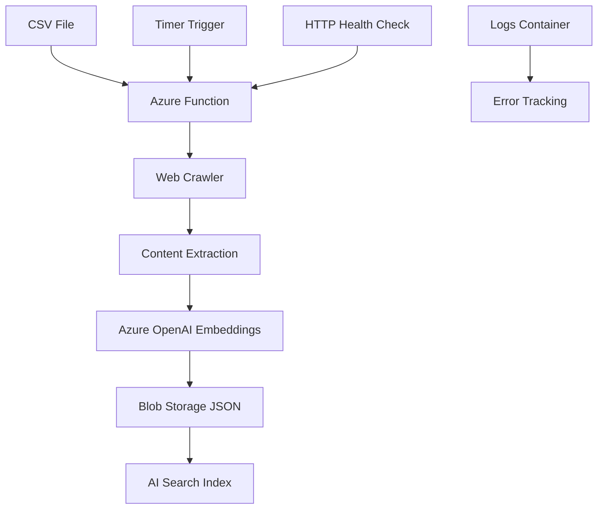

# Azure Function Web Crawler to Blob Storage

This project is an **Azure Function** that acts as a robust web crawler, designed to extract content (including HTML, PDF, DOCX, XLSX) from target websites, process it with Azure OpenAI embeddings, and upload the results as JSON documents to Azure Blob Storage. It supports **CSV-based URL management** with custom filename control and is optimized for data pipelines and AI search scenarios.

## ✨ Key Features

- **CSV-Driven Crawling**: Define URLs and custom filenames via CSV input for precise control
- **Multi-Format Content Extraction**: HTML, PDF, DOCX, XLSX support with content chunking
- **Azure OpenAI Integration**: Automatic text embedding generation for AI search scenarios
- **Flexible Storage Options**: Azure Blob Storage with custom naming from CSV
- **Robust Error Handling**: Retry logic, robots.txt respect, and comprehensive logging
- **Production Ready**: Timer-triggered Azure Function with health monitoring
- **Container Support**: Dockerfile included for easy deployment

## 📁 Project Structure

```text
azurefunction_webcrawler_to_blobstorage/
├── .gitignore
├── Dockerfile
├── README.md
├── CSV_INPUT_GUIDE.md        # Detailed CSV input instructions
├── crawler.py                # Main crawler logic with CSV support
├── function_app.py           # Azure Function entry points
├── host.json                 # Function host configuration
├── requirements.txt          # Python dependencies
├── local.settings.json.example  # Configuration template
├── input.csv                 # Sample CSV file (URLs + filenames)
├── .funcignore
├── .dockerignore
├── appsettings.json          # Not tracked; for Azure deployment only
├── local.settings.json       # Not tracked; for local development only
```

## 🚀 Quick Start

### Prerequisites

- Python 3.9+
- [Azure Functions Core Tools](https://learn.microsoft.com/azure/azure-functions/functions-run-local)
- [Azure CLI](https://docs.microsoft.com/cli/azure/install-azure-cli)
- Azure Subscription with:
  - Blob Storage account
  - Azure OpenAI service (for embeddings)
- Docker (optional, for container deployment)

### Setup

1. **Clone the repository:**
    ```bash
    git clone https://github.com/jdnuckolls/azurefunction_webcrawler_to_blobstorage.git
    cd azurefunction_webcrawler_to_blobstorage
    ```

2. **Prepare your CSV file:**
    ```csv
    Url,Filename,Fr_Filename
    https://example.com/page1,custom-name-1.html,french-name-1.html
    https://example.com/page2,custom-name-2.html,french-name-2.html
    ```
    Save as `input.csv` or see [CSV_INPUT_GUIDE.md](./CSV_INPUT_GUIDE.md) for advanced options.

3. **Install dependencies:**
    ```bash
    pip install -r requirements.txt
    ```

4. **Configure settings:**
    Copy `local.settings.json.example` to `local.settings.json` and update:
    ```bash
    cp local.settings.json.example local.settings.json
    # Edit local.settings.json with your Azure credentials and settings
    ```

5. **Run locally:**
    ```bash
    func start
    ```

6. **Deploy to Azure:**
    ```bash
    # Deploy function app
    func azure functionapp publish <your-function-app-name>
    
    # Upload CSV to blob storage (recommended for production)
    az storage blob upload \
      --account-name <your-storage-account> \
      --container-name config \
      --name input.csv \
      --file ./input.csv
    ```

## 📊 Usage

### Automated Crawling
- The crawler runs on a schedule (default: daily at 2am UTC) via a timer trigger
- Reads URLs from CSV file and crawls each site with specified depth
- Generates embeddings for content chunks using Azure OpenAI
- Stores results in Azure Blob Storage with custom filenames

### Manual Trigger & Monitoring
- **Health Check**: Send HTTP GET to `/api/ping` endpoint
- **Logs**: View Function App logs in Azure Portal or via CLI
- **Storage**: Check blob containers for crawled content and logs

### Output Format
Each crawled page generates JSON documents like:
```json
{
  "id": "unique-id",
  "url": "https://example.com/page",
  "title": "custom-filename-from-csv",
  "chunk_index": 1,
  "chunk_total": 3,
  "content": "extracted text content...",
  "last_modified": "2025-11-03T10:30:00Z",
  "embedding": [0.1, 0.2, ...]
}
```

## ⚙️ Configuration

### CSV Input Method (Recommended)

The crawler supports reading URLs and custom filenames from a CSV file, providing precise control over crawling targets and storage naming.

#### CSV Format:
```csv
Url,Filename,Fr_Filename
https://example.com/page1,custom-name-1.html,optional-third-column
https://example.com/page2,custom-name-2.html,optional-third-column
```

**📖 See [CSV_INPUT_GUIDE.md](./CSV_INPUT_GUIDE.md) for complete setup instructions.**

### Environment Variables

#### Core Storage Settings
```bash
STORAGE_ACCOUNT_NAME=<your-storage-account>
CONTAINER_NAME=content                    # Container for crawled content
LOG_CONTAINER_NAME=logs                   # Container for logs and metadata
```

#### CSV Configuration
```bash
CSV_CONTAINER_NAME=config                 # Container for CSV file (blob storage)
CSV_FILE_PATH=input.csv                   # Path to CSV file
```

#### Azure OpenAI Settings
```bash
AZURE_OPENAI_API_KEY=<your-api-key>
AZURE_OPENAI_ENDPOINT=https://<resource>.openai.azure.com/
AZURE_OPENAI_EMBEDDING_DEPLOYMENT_NAME=text-embedding-ada-002
AZURE_OPENAI_EMBEDDING_MODEL_NAME=text-embedding-ada-002
EMBEDDING_TOKEN_LIMIT=8191
```

#### Crawler Behavior
```bash
MAX_WORKERS=2                             # Parallel crawler threads
MAX_DEPTH=3                               # Maximum crawl depth
REQUEST_DELAY=0.5                         # Delay between requests (seconds)
PAGE_TIMEOUT_MS=45000                     # Page load timeout
MAX_CONTENT_CHARS=50000                   # Maximum content length per page
INCLUDE_PDFS=true                         # Crawl PDF files
INCLUDE_DOCX=true                         # Crawl Word documents
INCLUDE_XLSX=true                         # Crawl Excel files
RESPECT_ROBOTS=true                       # Respect robots.txt
RETRY_COUNT=3                             # HTTP retry attempts
```

#### Legacy Method (Environment Variables Only)
```bash
BASE_URLS=https://example.com;https://site2.com  # Semicolon-separated URLs
ALLOW_DOMAINS=example.com;site2.com              # Allowed domains
```

### Configuration Files

- **`local.settings.json`**: Local development settings (use `local.settings.json.example` as template)
- **`appsettings.json`**: Azure deployment settings (not tracked in git)
- **Function App Settings**: Configure via Azure Portal or Azure CLI

## 🔒 Security

- **Never commit secrets** to the repository
- Use Azure Key Vault for production secrets
- Function App uses Managed Identity for Azure resource access
- The `.gitignore` excludes all sensitive configuration files

## 🐳 Docker Deployment

```bash
# Build container
docker build -t webcrawler-function .

# Run locally with environment file
docker run --env-file .env -p 7071:80 webcrawler-function

# Deploy to Azure Container Registry
az acr build --registry <your-acr> --image webcrawler:latest .
```

## 📈 Monitoring & Troubleshooting

### Health Check
```bash
curl https://<your-function-app>.azurewebsites.net/api/ping
```

### View Logs
```bash
# Stream live logs
az functionapp log tail --name <function-app> --resource-group <rg>

# Check specific execution
az functionapp log download --name <function-app> --resource-group <rg>
```

### Common Issues
- **CSV not found**: Ensure CSV is uploaded to correct blob container
- **No embeddings**: Verify Azure OpenAI configuration and quotas
- **Timeout errors**: Adjust `PAGE_TIMEOUT_MS` and `MAX_WORKERS`
- **Permission errors**: Check Function App managed identity permissions

## 🏗️ Architecture



## 📄 License

MIT License

## 👤 Author

[Jeff Nuckolls](https://github.com/jdnuckolls)

---

*Built for large-scale content ingestion, AI search, and knowledge management systems.*
